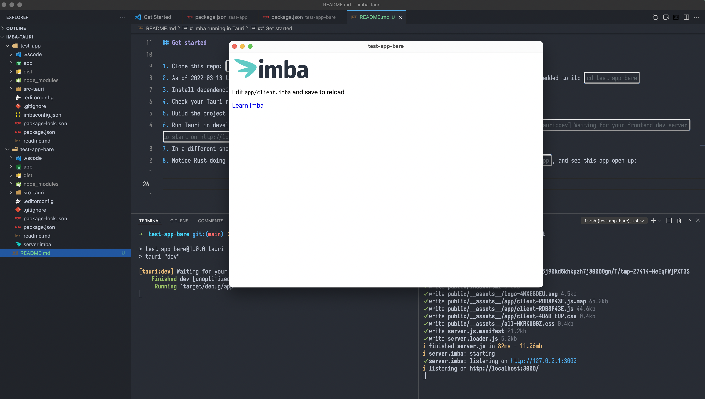

# Imba running in Tauri

This is a minimal example of [Imba](https://github.com/imba/imba) running in [Tauri](https://github.com/tauri-apps/tauri), as an alternative to Electron.

- The folder `test-app/` has attempts at modifying the Electron template for Imba to use Tauri instead. **WIP, do not use.**
- The folder `test-app-bare/` has the base Imba template (`npx imba create test-app-bare`), with Tauri added to it. **Ready for use.**

## Requirements

1. Follow the [prerequisites for Tauri](https://tauri.app/v1/guides/getting-started/prerequisites)
2. [Verify your install](https://tauri.studio/docs/getting-started/beginning-tutorial#3-check-tauri-info-to-make-sure-everything-is-set-up-properly) by running `npm run tauri info`.
    - Note: If you are not seeing your Rust versions after install, you may need to restart your shell or `source $HOME/.cargo/env`
4. Node / NPM. I used `v16.14.0`

## Get started

1. Clone this repo: `git clone git@github.com:codeluggage/imba-tauri.git`
2. As of 2022-03-13 the `test-app/` folder is WIP and does not work. Instead, use the basic Imba template that has Tauri added to it: `cd test-app-bare`
3. Install dependencies: `npm i`
4. Check your Tauri requirements: `npm run tauri info`
5. Build the project with `npm run build`
6. Run Tauri in development mode with `npm run tauri dev` - it should sit and wait for your local server to start up: `[tauri:dev] Waiting for your frontend dev server to start on http://localhost:3000/...`
7. In a different shell, run Imba in development mode with `npm start`
8. Notice Rust doing its thing, downloading and installing things. Once it's ready you should see `Running target/debug/app`, and see this app open up:

